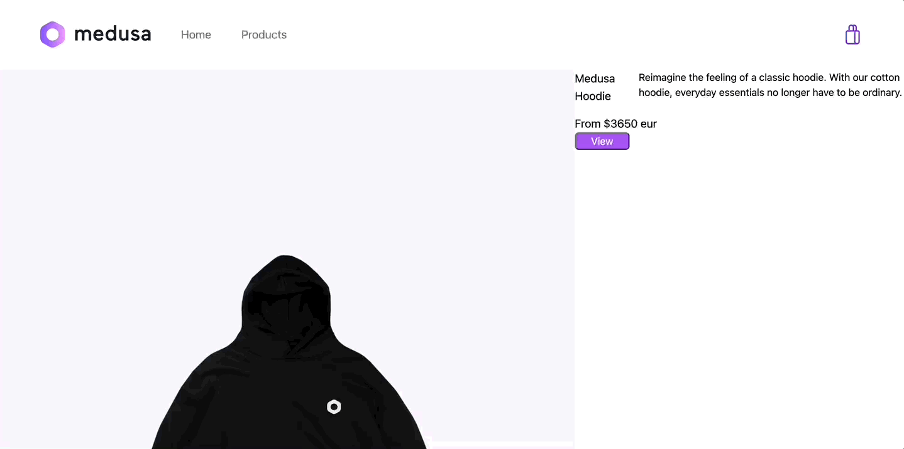

# Medusa Jekyll Starter Template


## About
### Participants

- [@Theosaurus-Rex](https://github.com/Theosaurus-Rex/)
  - Twitter: [@dino_coder](https://twitter.com/dino_coder)
  - Discord: Theosaurus#5141


- [@biancapower](https://github.com/biancapower/)
  - Twitter: [@20by31](https://twitter.com/20by31)
  - Discord: power#7764

### Description
This is a starter template for building a Jekyll storefront with a Medusa backend. It uses Alpine.js for lightweight dynamic functionality.

NOTE: Some features are a work in progress.

### Preview



## Set up Project

1. Clone the repo:

  ```bash
  git clone https://github.com/Theosaurus-Rex/medusa-jekyll-starter.git
  ```

2. Ensure you have `ruby 2.7.2` installed

3. Change directory and install dependencies:

  ```bash
  cd medusa-jekyll-starter
  bundle install
  npm install
  ```

4. Ensure you have a Medusa instance running locally. If you don't, you can follow the [Medusa Quickstart](https://docs.medusa-commerce.com/quickstart) guide to get started.

5. Run the project:

  ```bash
  jekyll serve
  ```

6. Open the project in your browser at `http://localhost:4000`

## Resources

- [Medusa's Github repository](https://github.com/medusajs/medusa)
- [Jekyll documentation](https://jekyllrb.com/)
- [Alpine.js documentation](https://alpinejs.dev/)
